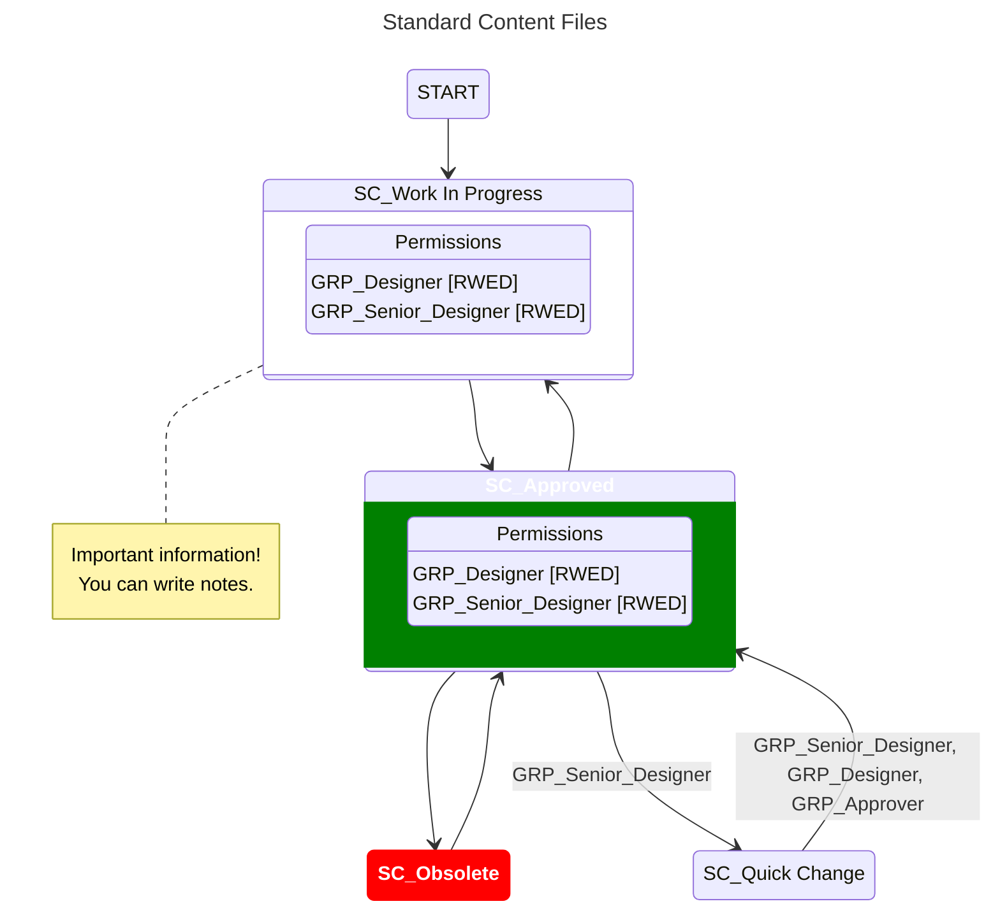

**LifeCycles**

**Standard Content Files**

```mermaid
---
title: Standard Content Files
---
stateDiagram-v2

classDef obsolete fill:red,color:white,font-weight:bold,stroke-width:2px,stroke:red
classDef approved fill:green,color:white,font-weight:bold,stroke-width:2px,stroke:green

  State0: START
  State1: SC_Work In Progress
  State2: SC_Approved
  State3: SC_Obsolete
  State4: SC_Quick Change

  class State2 approved
  class State3 obsolete

  Permissions1: Permissions
  Permissions1: GRP_Designer [RWED]
  Permissions1: GRP_Senior_Designer [RWED]
  Permissions2: Permissions
  Permissions2: GRP_Designer [RWED]
  Permissions2: GRP_Senior_Designer [RWED]
  
  State0 --> State1
  State1 --> State2
  State2 --> State1
  State2 --> State3
  State2 --> State4: GRP_Senior_Designer
  State3 --> State2
  State4 --> State2: GRP_Senior_Designer, GRP_Designer, GRP_Approver  

  state State1 {
  	Permissions1
  }
  state State2 {
  	Permissions2
  }

  note right of State1
    Important information!
    You can write notes.
    end note
```
