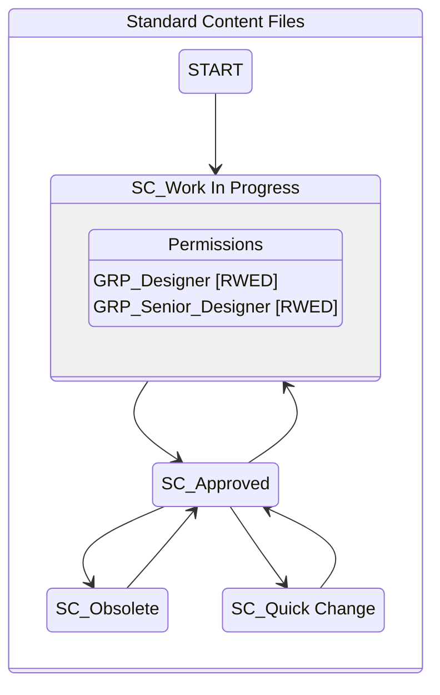

**LifeCycles**

**Standard Content Files**

```mermaid
stateDiagram-v2
state "Standard Content Files" as LifeCycle {

State0: START
State1: SC_Work In Progress
State2: SC_Approved
State3: SC_Obsolete
State4: SC_Quick Change
Permissions1: Permissions
Permissions1: GRP_Designer [RWED]
Permissions1: GRP_Senior_Designer [RWED]

State0 --> State1
State1 --> State2
State2 --> State1
State2 --> State3
State2 --> State4
State3 --> State2
State4 --> State2

state State1 {
	Permissions1
}

}
```
